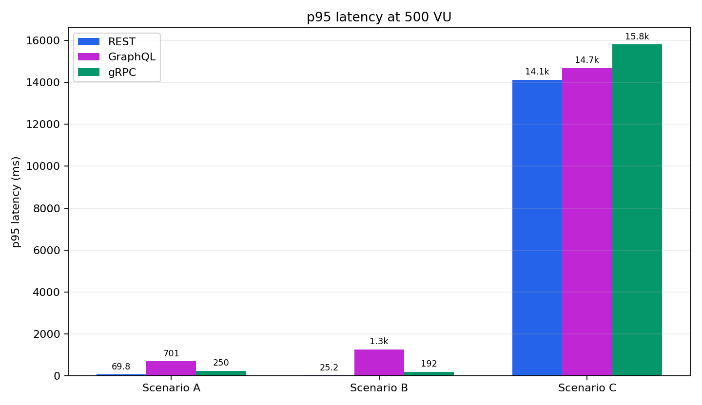
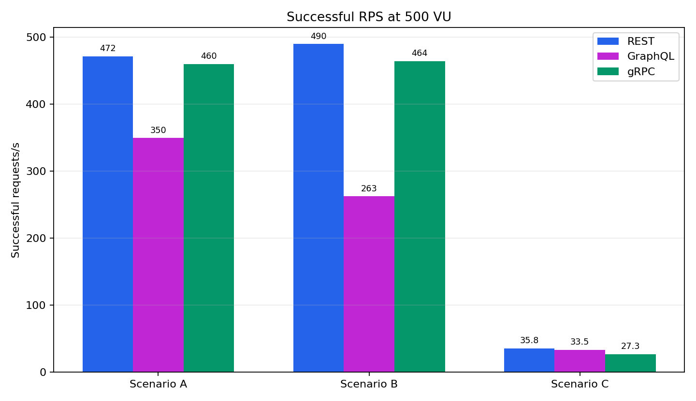
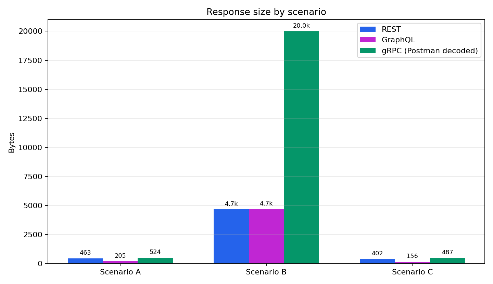
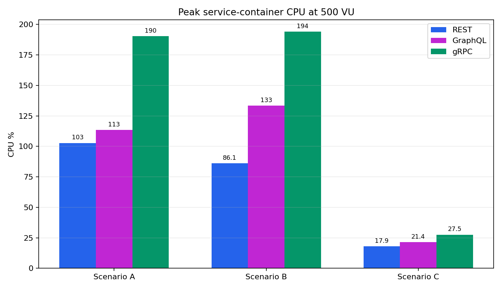
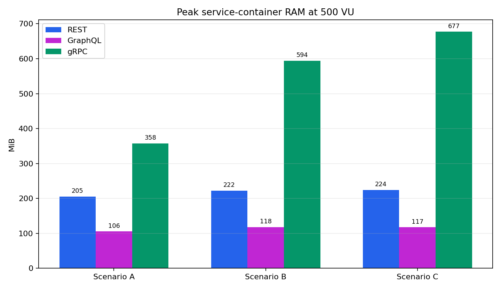

# IoTFarmBench: komparativna analiza REST, gRPC i GraphQL komunikacije u IoT mikroservisnom sistemu

**Predmet:** Internet stvari i servisa  
**Projekat:** Projekat 1 - Komparativna analiza sinhronih komunikacionih paradigmi u IoT mikroservisnim sistemima  
**Tema implementacije:** Smart Farming IoT benchmark sistem  
**Protokoli koji se porede:** REST, gRPC i GraphQL  

## 1. Uvod

Projekat IoTFarmBench implementira i evaluira tri sinhrona komunikaciona modela u istom IoT mikroservisnom sistemu: REST, gRPC i GraphQL. Cilj projekta je da se na istom dataset-u, istoj PostgreSQL bazi i istim scenarijima opterecenja uporedi kako izbor komunikacione paradigme utice na latenciju, broj uspesnih zahteva u sekundi, velicinu odgovora i potrosnju CPU/RAM resursa.

Sistem je zasnovan na Smart Farming domenu. Dataset sadrzi vremenski serijalizovana senzorska ocitavanja sa farmi, ukljucujuci timestamp, identifikator senzora, region, GPS koordinate, tip useva, temperaturu, vlaznost vazduha, vlaznost zemljista, pH vrednost zemljista, kolicinu padavina, broj sati sunceve svetlosti, NDVI indeks i prinos. Time su ispunjeni zahtevi specifikacije da dataset poseduje timestamp i vise razlicitih senzorskih vrednosti.

Evaluacija se sprovodi kroz tri obavezna scenarija:

- Scenario A - High-Frequency Ingestion: simulacija uredjaja koji cesto salju nova senzorska merenja.
- Scenario B - Selective Monitoring: klijent trazi samo 2 od dostupnih senzorskih vrednosti.
- Scenario C - Heavy Querying: analiticki upiti i agregacije nad istorijskim podacima.

## 2. Arhitektura sistema

Sistem je kontejnerizovan pomocu Docker Compose-a i sastoji se od sledecih komponenti:

- PostgreSQL baza podataka.
- Python importer za ucitavanje CSV dataset-a.
- REST mikroservis implementiran u ASP.NET Core Web API tehnologiji.
- gRPC mikroservis implementiran u ASP.NET Core gRPC tehnologiji.
- GraphQL mikroservis implementiran u Node.js/Apollo Server tehnologiji.
- k6 testovi za opterecenje i merenje performansi.
- Pomocne skripte za Docker stats merenja i generisanje grafika.

Sva tri API servisa pristupaju istoj PostgreSQL bazi. To omogucava fer poredjenje jer se protokoli testiraju nad istim podacima i istom baznom infrastrukturom. Projekat koristi vise od dve tehnologije: ASP.NET Core za REST i gRPC, Node.js za GraphQL i Python za importer.

Pokretanje sistema:

```powershell
docker compose up --build -d
```

Ucitavanje dataset-a:

```powershell
docker compose run --rm importer
```

## 3. PostgreSQL baza podataka

Baza se inicijalizuje skriptom:

```text
database/init/001_create_schema.sql
```

Model se sastoji od dve glavne tabele:

- `devices` - cuva jedinstvene IoT uredjaje, odnosno senzore.
- `sensor_readings` - cuva vremenski serijalizovana senzorska ocitavanja.

Tabela `sensor_readings` sadrzi timestamp, vezu ka uredjaju i vise numerickih senzorskih vrednosti. Za IoT upite su dodati indeksi po najcescim kriterijumima pretrage:

- indeks po `device_id` i `timestamp`,
- indeks po `timestamp`,
- indeks po `sensor_id`,
- indeks po `region`,
- indeks po `crop_type`.

Ovi indeksi podrzavaju tipicne IoT obrasce: dohvatanje poslednjih merenja, filtriranje po vremenu, filtriranje po senzoru ili regionu i izvrsavanje analitickih agregacija.

## 4. Implementirani mikroservisi

### 4.1 REST servis

REST servis je implementiran u ASP.NET Core Web API tehnologiji i izlozen na portu `5000`. Koristi JSON format i poseduje Swagger/OpenAPI dokumentaciju, cime ispunjava zahtev specifikacije za dokumentovan REST API.

Primeri endpoint-a:

```text
GET  /api/devices
GET  /api/readings?limit=100
POST /api/readings
GET  /api/readings/selective?fields=temperatureC,humidityPercent&limit=100
GET  /api/analytics/summary
GET  /api/analytics/by-region
```

REST je najjednostavniji za koriscenje i debagovanje, a u ovom projektu se posebno dobro pokazuje kada postoje namenski endpointi oblikovani za konkretan scenario.

### 4.2 gRPC servis

gRPC servis je implementiran u ASP.NET Core gRPC tehnologiji i izlozen na portu `5001`. Ugovor servisa definisan je Protobuf fajlom:

```text
services/grpc-service/Protos/farm_benchmark.proto
```

Servis `FarmBenchmarkService` sadrzi RPC metode za citanje uredjaja, citanje senzorskih ocitavanja, kreiranje novog ocitavanja, selektivno citanje i analiticke agregacije. gRPC koristi HTTP/2 i binarni Protobuf format, a u projektu je ukljucena i gRPC reflection podrska radi lakseg testiranja alatima kao sto su Postman i grpcurl.

gRPC je posebno pogodan za internu komunikaciju izmedju servisa jer obezbedjuje tipiziran ugovor i efikasnu komunikaciju, ali rezultati pokazuju da performanse i dalje zavise od implementacije, konekcija i opterecenja baze.

### 4.3 GraphQL servis

GraphQL servis je implementiran u Node.js tehnologiji pomocu Apollo Server-a i izlozen na portu `5002`. Schema definise tipove za uredjaje, senzorska ocitavanja i analiticke rezultate.

Najvaznija prednost GraphQL pristupa u ovom projektu je selective monitoring, jer klijent moze da zatrazi samo polja koja su mu potrebna. Primer:

```graphql
query {
  readings(limit: 100) {
    temperatureC
    humidityPercent
  }
}
```

Ovim se izbegava over-fetching bez uvodjenja posebnog endpoint-a za svaku kombinaciju polja.

## 5. Scenariji evaluacije

### Scenario A - High-Frequency Ingestion

U ovom scenariju simulira se veliki broj IoT uredjaja koji u kratkim intervalima salju nova merenja. Svaka iteracija k6 testa kreira jedno novo senzorsko ocitavanje. Fokus je na brzini upisa, overhead-u protokola, validaciji podataka i radu sa bazom.

### Scenario B - Selective Monitoring

U ovom scenariju klijent trazi samo dve vrednosti: `temperatureC` i `humidityPercent`, za poslednjih 100 ocitavanja. Scenario predstavlja mobilnu ili edge aplikaciju sa ogranicenom vezom, gde je vazno vratiti samo neophodne podatke.

### Scenario C - Heavy Querying

U ovom scenariju klijent izvrsava analiticke upite nad istorijskim podacima. Test naizmenicno izvrsava summary agregaciju i agregaciju po regionu. Fokus je na slozenim upitima, opterecenju baze i ponasanju sistema pod vecim brojem paralelnih korisnika.

## 6. Metodologija merenja

Performanse su merene alatom k6 za 10, 100 i 500 virtuelnih korisnika. Za svaki protokol i svaki scenario prikupljene su sledece metrike:

- prosecna latencija,
- p95 latencija,
- maksimalna latencija,
- broj uspesnih zahteva u sekundi,
- procenat uspesnih provera.

Za RPS se koristi metrika uspesnih zahteva u sekundi, a ne samo ukupan broj poslatih zahteva. Ovo je vazno jer pod velikim opterecenjem ukupan request rate moze biti varljiv ako deo zahteva ne uspeva.

Velicine odgovora merene su u Postman-u. REST i GraphQL vrednosti predstavljaju velicinu JSON response body-ja iz Postman Console prikaza. gRPC vrednosti predstavljaju velicinu dekodovane gRPC poruke u Postman gRPC okruzenju. One nisu isto sto i niskonivojsko Wireshark merenje sirovih HTTP/2/Protobuf frame-ova, pa se u zakljucima tumace oprezno.

CPU i RAM su mereni pomocu `docker stats` tokom 500 VU testova. Prikazane vrednosti su peak vrednosti aktivnog servisnog kontejnera i PostgreSQL kontejnera.

## 7. k6 rezultati

| Protokol | Scenario | VU | Prosecna latencija | p95 latencija | Max latencija | Uspesni RPS | Uspesnost provera |
| --- | --- | ---: | ---: | ---: | ---: | ---: | ---: |
| REST | A - Ingestion | 10 | 76.03 ms | 110.04 ms | 1.61 s | 9.28 | 100.00% |
| REST | A - Ingestion | 100 | 22.66 ms | 34.91 ms | 419.51 ms | 96.92 | 100.00% |
| REST | A - Ingestion | 500 | 33.80 ms | 69.80 ms | 815.78 ms | 471.84 | 100.00% |
| REST | B - Selective Monitoring | 10 | 7.94 ms | 5.16 ms | 142.43 ms | 9.91 | 100.00% |
| REST | B - Selective Monitoring | 100 | 5.54 ms | 12.39 ms | 74.81 ms | 99.15 | 100.00% |
| REST | B - Selective Monitoring | 500 | 7.61 ms | 25.20 ms | 273.87 ms | 489.94 | 100.00% |
| REST | C - Heavy Querying | 10 | 148.27 ms | 291.99 ms | 584.26 ms | 8.58 | 100.00% |
| REST | C - Heavy Querying | 100 | 1.42 s | 2.16 s | 3.60 s | 39.77 | 100.00% |
| REST | C - Heavy Querying | 500 | 10.95 s | 14.12 s | 14.76 s | 35.83 | 100.00% |
| GraphQL | A - Ingestion | 10 | 27.75 ms | 46.96 ms | 335.84 ms | 9.71 | 100.00% |
| GraphQL | A - Ingestion | 100 | 26.45 ms | 43.30 ms | 691.82 ms | 96.18 | 100.00% |
| GraphQL | A - Ingestion | 500 | 390.40 ms | 701.39 ms | 7.11 s | 349.58 | 100.00% |
| GraphQL | B - Selective Monitoring | 10 | 9.26 ms | 13.37 ms | 156.94 ms | 9.86 | 100.00% |
| GraphQL | B - Selective Monitoring | 100 | 17.58 ms | 35.77 ms | 508.60 ms | 97.19 | 100.00% |
| GraphQL | B - Selective Monitoring | 500 | 842.06 ms | 1.26 s | 22.20 s | 262.57 | 100.00% |
| GraphQL | C - Heavy Querying | 10 | 141.56 ms | 229.22 ms | 541.13 ms | 8.71 | 100.00% |
| GraphQL | C - Heavy Querying | 100 | 1.56 s | 2.29 s | 3.56 s | 37.99 | 100.00% |
| GraphQL | C - Heavy Querying | 500 | 11.66 s | 14.68 s | 15.27 s | 33.51 | 100.00% |
| gRPC | A - Ingestion | 10 | 45.97 ms | 38.46 ms | 928.97 ms | 9.52 | 100.00% |
| gRPC | A - Ingestion | 100 | 21.94 ms | 42.50 ms | 345.72 ms | 96.89 | 100.00% |
| gRPC | A - Ingestion | 500 | 61.04 ms | 249.88 ms | 799.29 ms | 460.10 | 100.00% |
| gRPC | B - Selective Monitoring | 10 | 5.37 ms | 6.13 ms | 66.09 ms | 9.90 | 100.00% |
| gRPC | B - Selective Monitoring | 100 | 7.39 ms | 19.24 ms | 199.61 ms | 97.77 | 100.00% |
| gRPC | B - Selective Monitoring | 500 | 37.82 ms | 192.09 ms | 620.66 ms | 464.20 | 100.00% |
| gRPC | C - Heavy Querying | 10 | 132.30 ms | 191.27 ms | 413.48 ms | 8.71 | 100.00% |
| gRPC | C - Heavy Querying | 100 | 1.89 s | 2.80 s | 4.76 s | 33.44 | 100.00% |
| gRPC | C - Heavy Querying | 500 | 12.84 s | 15.80 s | 16.87 s | 27.29 | 90.58% |

Grafici:





## 8. Analiza k6 rezultata

U Scenariju A, pri 500 VU, REST ostvaruje 471.84 uspesnih zahteva u sekundi, gRPC 460.10, a GraphQL 349.58. REST i gRPC su blizu po propusnosti, dok GraphQL pokazuje vecu prosecnu i p95 latenciju pri najvecem opterecenju. Razlog je kombinacija mutation obrade, parsiranja GraphQL upita, resolver sloja i rada Node.js runtime-a pod velikim brojem paralelnih zahteva.

U Scenariju B, REST ima najbolji rezultat pri 500 VU: p95 latencija je 25.20 ms, a uspesni RPS 489.94. gRPC takodje radi stabilno, sa p95 latencijom 192.09 ms i 464.20 uspesnih zahteva u sekundi. GraphQL omogucava prirodnu selekciju polja, ali pri 500 VU ima znatno vecu latenciju od REST-a i gRPC-a. To pokazuje da sama mogucnost selective fetching-a ne garantuje automatski najbolje performanse, jer postoji overhead parsiranja upita i resolver sloja.

U Scenariju C, sva tri protokola pokazuju mnogo vece latencije pri 500 VU. REST ima p95 od 14.12 s, GraphQL 14.68 s, a gRPC 15.80 s. Ovo pokazuje da je heavy querying scenario dominantno database-bound. Drugim recima, najveci trosak dolazi iz konkurentnog izvrsavanja agregacionih SQL upita nad istorijskim podacima, a ne samo iz formata poruke ili protokola.

Bitna korekcija u interpretaciji je da GraphQL heavy-querying ne treba predstavljati kao dramaticno brzi samo zato sto moze da vrati manje polja. U finalnom poredjenju GraphQL trazi ista analiticka polja kao REST/gRPC, pa je poredjenje realnije.

## 9. Velicina odgovora

| Protokol | Scenario | Velicina odgovora | Izvor |
| --- | --- | ---: | --- |
| REST | A - High-Frequency Ingestion | 463 B | Postman Console, JSON body |
| REST | B - Selective Monitoring | 4674 B | Postman Console, JSON body |
| REST | C - Heavy Querying | 402 B | Postman Console, JSON body |
| GraphQL | A - High-Frequency Ingestion | 205 B | Postman Console, JSON body |
| GraphQL | B - Selective Monitoring | 4700 B | Postman Console, JSON body |
| GraphQL | C - Heavy Querying | 156 B | Postman Console, JSON body |
| gRPC | A - High-Frequency Ingestion | 524 B | Postman decoded gRPC message |
| gRPC | B - Selective Monitoring | oko 20 KB | Postman decoded gRPC message |
| gRPC | C - Heavy Querying | 487 B | Postman decoded gRPC message |



REST i GraphQL vrednosti su JSON response-body vrednosti iz Postman Console prikaza. GraphQL ima najmanji odgovor u Scenariju A i C zato sto klijent u upitu precizno definise koja polja zeli da dobije. U Scenariju B REST i GraphQL su slicni, jer oba vracaju 100 ocitavanja sa dve vrednosti.

gRPC vrednosti su ocitane kao dekodovana poruka u Postman gRPC okruzenju. Posebno je vazno napomenuti da vrednost od oko 20 KB za gRPC selective monitoring nije raw Protobuf wire-size, vec Postman decoded prikaz. `GetSelectiveReadings` logicki vraca trazena polja, ali odgovor koristi tipiziranu Protobuf strukturu. Postman moze prikazati dodatnu strukturu i default vrednosti, pa ova vrednost ne sme da se tumaci kao direktan dokaz da je binarni gRPC payload stvarno veci od JSON payload-a. Za takav zakljucak bilo bi potrebno niskonivojsko merenje pomocu Wireshark-a ili slicnog alata.

## 10. Docker stats rezultati

Docker stats su prikupljeni tokom 500 VU testova. Tabela prikazuje peak CPU/RAM aktivnog servisnog kontejnera i PostgreSQL kontejnera.

| Protokol | Scenario | Aktivni servis CPU peak | Aktivni servis RAM peak | PostgreSQL CPU peak | PostgreSQL RAM peak |
| --- | --- | ---: | ---: | ---: | ---: |
| REST | A - Ingestion | 102.75% | 205.3 MiB | 122.80% | 215.7 MiB |
| REST | B - Selective Monitoring | 86.09% | 222.5 MiB | 56.64% | 217.7 MiB |
| REST | C - Heavy Querying | 17.94% | 224.1 MiB | 1259.18% | 351.8 MiB |
| GraphQL | A - Ingestion | 113.39% | 105.6 MiB | 85.08% | 298.2 MiB |
| GraphQL | B - Selective Monitoring | 133.31% | 118.2 MiB | 34.25% | 301.1 MiB |
| GraphQL | C - Heavy Querying | 21.38% | 117.4 MiB | 1238.40% | 428.6 MiB |
| gRPC | A - Ingestion | 190.28% | 357.8 MiB | 240.74% | 225.2 MiB |
| gRPC | B - Selective Monitoring | 193.98% | 594.0 MiB | 114.92% | 227.3 MiB |
| gRPC | C - Heavy Querying | 27.47% | 677.1 MiB | 1211.51% | 289.3 MiB |





Docker CPU procenat moze biti veci od 100% jer Docker sabira potrosnju kroz vise CPU jezgara. Vrednosti u tabeli predstavljaju peak, a ne prosecnu potrosnju tokom celog testa.

U Scenariju C PostgreSQL CPU peak prelazi 1200% kod sva tri protokola. To potvrdjuje da su heavy querying testovi dominantno ograniceni radom baze. Aktivni servis u tom scenariju ima relativno nizak CPU peak u poredjenju sa bazom, jer najveci deo vremena odlazi na cekanje i obradu agregacionih SQL upita.

U Scenarijima A i B veci znacaj imaju obrada zahteva, validacija, serijalizacija/deserijalizacija, connection pooling i mapiranje izmedju DTO/Protobuf/GraphQL objekata i modela baze. gRPC servis u merenjima ima najvece peak RAM vrednosti, posebno u selective monitoring i heavy querying scenarijima. To ukazuje da implementacija i runtime karakteristike mogu znacajno uticati na resurse, cak i kada je protokol teoretski efikasan.

## 11. Trosak serijalizacije i deserijalizacije

Specifikacija trazi analizu pitanja koliko serijalizacija i deserijalizacija kostaju na procesorskom nivou. Na osnovu Docker stats rezultata moze se dati sistemska procena, ali ne i potpuno izolovano merenje samo serijalizacije. Docker stats CPU ukljucuje:

- obradu HTTP/gRPC zahteva,
- JSON ili Protobuf serijalizaciju,
- GraphQL parsing i resolver izvrsavanje,
- pristup bazi,
- connection pooling,
- rad runtime-a,
- garbage collection,
- mapiranje objekata,
- SQL agregacije.

Zato se ne moze reci da je sva CPU razlika posledica samo formata poruke. Ipak, rezultati daju korisne smernice. REST je vrlo konkurentan kada je endpoint tacno oblikovan za scenario. GraphQL placa dodatni trosak parsiranja upita i resolver sloja, ali nudi fleksibilnost selekcije polja. gRPC koristi tipizirane Protobuf poruke i HTTP/2, ali zahteva pazljivu implementaciju konekcija i mapiranja da bi se prednosti videle u praksi.

## 12. Ogranicenja merenja

Merenja su izvrsena lokalno u Docker Desktop okruzenju i zavise od hardvera racunara, trenutnog opterecenja sistema, Docker konfiguracije i stanja baze. Zbog toga apsolutne vrednosti ne treba tumaciti kao univerzalne, vec kao eksperimentalne rezultate u datom okruzenju.

Postman response-size merenja za REST i GraphQL su direktnija jer se citaju JSON body velicine. gRPC merenje u Postman-u predstavlja decoded response prikaz, ne sirovu Protobuf velicinu na mrezi. Za precizno poredjenje binarnog payload-a bio bi potreban Wireshark ili drugi niskonivojski network capture.

Takodje, Docker stats ne izoluje samo serijalizaciju/deserijalizaciju, vec prikazuje ukupno ponasanje kontejnera. Zato je analiza resursa korisna za prakticno poredjenje sistema, ali nije mikrobenchmark samog kodiranja poruka.

## 13. Zakljucak

Projekat ispunjava zahteve specifikacije: koristi vremenski serijalizovan IoT dataset sa vise senzorskih vrednosti, PostgreSQL bazu optimizovanu indeksima po vremenu i uredjaju, tri odvojena mikroservisa u vise tehnologija, Docker Compose kontejnerizaciju, k6 testove za 10/100/500 virtuelnih korisnika, Postman merenje velicine odgovora i Docker stats pracenje CPU/RAM resursa.

Najvazniji zakljucak je da ne postoji univerzalni pobednik za sve IoT scenarije. REST je najprakticniji i veoma efikasan kada postoje namenski endpointi za konkretne operacije. GraphQL je najfleksibilniji kada klijentima treba izbor tacnih polja i kada je izbegavanje over-fetching-a vaznije od minimalnog serverskog overhead-a. gRPC je pogodan za internu mikroservisnu komunikaciju i tipizirane ugovore, ali u scenarijima gde baza dominira, sam protokol ne moze da ukloni glavni izvor kasnjenja.

U Scenariju A REST i gRPC ostvaruju najbolju propusnost pri velikom opterecenju. U Scenariju B REST je najbrzi zbog namenski oblikovanog selective endpoint-a, dok gRPC ostaje stabilan nakon pravilnog koriscenja konekcija. U Scenariju C svi protokoli imaju slican red velicine latencije jer PostgreSQL agregacije postaju glavno usko grlo.

Prakticna preporuka je da se izbor protokola vezuje za konkretan IoT slucaj upotrebe:

- REST za javne API-je, jednostavnu integraciju i jasne endpoint-e.
- GraphQL za klijente koji cesto menjaju skup potrebnih polja.
- gRPC za internu komunikaciju izmedju servisa sa jakim tipovima i definisanim ugovorom.

## 14. Kratka prezentacija za odbranu

### Slajd 1 - Tema

IoTFarmBench: poredjenje REST, gRPC i GraphQL komunikacije u IoT mikroservisnom sistemu za pametnu poljoprivredu.

### Slajd 2 - Cilj

Cilj je da se proveri kako izbor sinhronog komunikacionog modela utice na latenciju, RPS, velicinu odgovora i potrosnju CPU/RAM resursa u IoT sistemu.

### Slajd 3 - Dataset

Koriscen je Smart Farming dataset sa timestamp kolonom i vise senzorskih vrednosti: temperatura, vlaznost, vlaznost zemljista, pH, padavine, sunceva svetlost, NDVI, prinos i lokacija.

### Slajd 4 - Arhitektura

Sistem se sastoji od PostgreSQL baze, Python importera, REST servisa u ASP.NET Core-u, gRPC servisa u ASP.NET Core-u, GraphQL servisa u Node.js/Apollo Server-u i k6/Docker stats benchmark skripti.

### Slajd 5 - Baza

Baza ima tabele `devices` i `sensor_readings`. Indeksi su dodati po uredjaju, timestamp-u, senzoru, regionu i tipu useva da bi se podrzali tipicni IoT upiti.

### Slajd 6 - Servisi

REST koristi JSON i Swagger/OpenAPI. gRPC koristi Protobuf i `.proto` definicije. GraphQL omogucava izbor tacnih polja i smanjenje over-fetching-a.

### Slajd 7 - Scenariji

Scenario A meri brzinu upisa. Scenario B meri selective monitoring kada se traze samo dve vrednosti. Scenario C meri slozene agregacije nad istorijskim podacima.

### Slajd 8 - k6 metodologija

Za svaki protokol i scenario testirano je 10, 100 i 500 virtuelnih korisnika. Merene su prosecna latencija, p95 latencija, maksimalna latencija i uspesni RPS.

### Slajd 9 - Najvazniji rezultat za 500 VU

REST je najbolji u selective monitoring scenariju, gRPC je blizu REST-u u ingestion i selective scenarijima, a GraphQL ima veci overhead pri visokom opterecenju. Heavy querying je slican za sva tri protokola jer dominira baza.

### Slajd 10 - Velicina odgovora

REST i GraphQL response-size vrednosti su JSON body iz Postman Console prikaza. gRPC vrednosti su Postman decoded gRPC poruke, pa ih ne treba predstavljati kao raw Protobuf wire-size bez Wireshark merenja.

### Slajd 11 - Docker stats

U heavy querying scenariju PostgreSQL CPU peak prelazi 1200% kod sva tri protokola. To pokazuje da su agregacije nad bazom glavno usko grlo, a ne samo komunikacioni protokol.

### Slajd 12 - Zakljucak

REST je najbolji izbor za jednostavne i jasno definisane API-je. GraphQL je najbolji kada je fleksibilna selekcija polja glavni zahtev. gRPC je pogodan za internu tipiziranu komunikaciju, ali njegove prednosti zavise od implementacije i od toga da baza nije glavno usko grlo.
